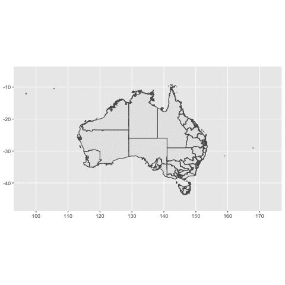

<!-- README.md is generated from README.Rmd. Please edit that file -->

# hexmap

<!-- badges: start -->

[](https://lifecycle.r-lib.org/articles/stages.html#experimental)
<!-- badges: end -->

The goal of hexmap is to …

## Installation

You can install the development version of hexmap like so:

``` r
install.packages("remotes")
remotes::install_github("emitanaka/hexmap")
```

## Example

Let’s use the ABS map data provided via `strayr`R package (this is a
developmental package so go
[here](https://github.com/runapp-aus/strayr/) to see how to install it).

``` r
library(hexmap)
library(gganimate)
#> Loading required package: ggplot2

SA4map <- add_hexmap(strayr::read_absmap("sa42021"))
SA4maplong <- transition_map_data(SA4map, hex, geometry)
```

``` r
ggplot(SA4maplong) + 
  geom_sf(aes(geometry = geometry)) + 
  transition_states(type) 
```


