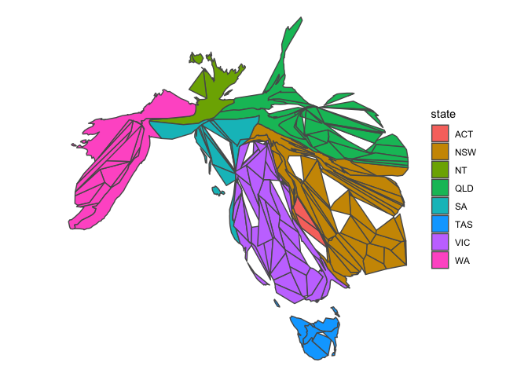

<!-- README.md is generated from README.Rmd. Please edit that file -->

# hexmap

<!-- badges: start -->

[](https://lifecycle.r-lib.org/articles/stages.html#experimental)
<!-- badges: end -->

The hexmap R package aims to automate the conversion of geospatial
polygons into hexagonal grids. This conversion allows users to better
visualise statistical values associated with each geospatial region.

## Installation

You can install the development version of hexmap like so:

``` r
install.packages("remotes")
remotes::install_github("numbats/hexmap")
```

## Method

1.  Make a cartogram so that each region has an approximately equal area
    (optional)
2.  Create a hexagonal grid based on this cartogram or other geospatial
    object
3.  Assign the region to the “closest” hexagon

## Example: Australian federal election 2022

``` r
library(hexmap)
library(sf)
library(cartogram)
library(ggplot2)
library(dplyr)
set.seed(1)

winner_map <- function(data) {
  party_colors <- c("ALP" = "red3", "LNP" = "blue3", "GRN" = "seagreen", "Other" = "yellow2")
  ggplot(data) + 
    geom_sf(aes(fill = winner)) +
    theme_void() + 
    scale_fill_manual(values = party_colors) 
}

state_map <- function(data) {
  ggplot(data) + 
    geom_sf(aes(fill = state)) +
    theme_void() 
}
```

The data `aec2022` in hexmap is an `sf` object with a simplified
Australian federal electoral boundary and the corresponding party that
won the 2022 Australian federal election for that electoral division.

### Choropleth map

``` r
winner_map(aec2022)
```


### Cartogram

``` r
aec2022carto <- aec2022 %>% 
  st_transform(crs = "+init=epsg:3112") %>% 
  mutate(weight = 1) %>% 
  cartogram_cont("weight", itermax = 50)

winner_map(aec2022carto)
```


``` r
state_map(aec2022carto)
```



### `geogrid` hexagonal map

``` r
hex <- geogrid::calculate_grid(aec2022carto, grid_type = "hexagonal")
res <- geogrid::assign_polygons(aec2022carto, hex)

state_map(res)
```


## Related

-   [`geogrid`](https://github.com/jbaileyh/geogrid) package
